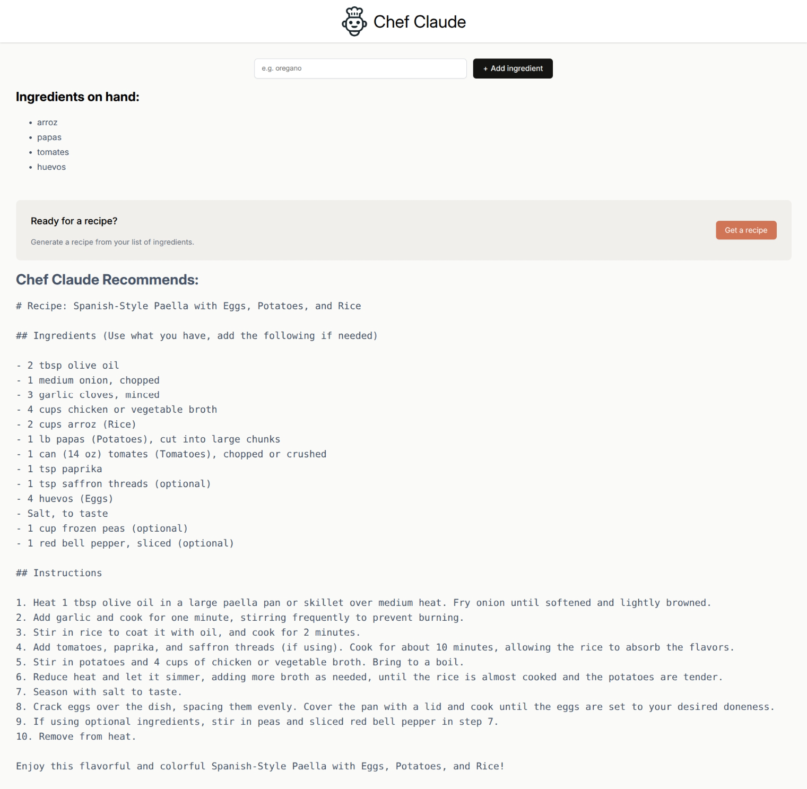

# 🍳 AI Recipe Generator

[](https://github.com/yourusername/chef-claude)
[](LICENSE)
[](https://reactjs.org/)
[](https://vitejs.dev/)

## 📖 Descripción Breve

Esta es una aplicación web interactiva desarrollada con React que permite a los usuarios generar recetas personalizadas utilizando inteligencia artificial. Los usuarios pueden ingresar una lista de ingredientes disponibles y obtener sugerencias de recetas creativas basadas en esos ingredientes, utilizando el modelo de IA Mistral a través de la plataforma HuggingFace.

## ✨ Características Principales

- 🍎 **Gestión de Ingredientes**: Agrega fácilmente ingredientes a tu lista con un formulario intuitivo
- 🤖 **Generación de Recetas con IA**: Utiliza el modelo Mistral para crear recetas originales basadas en tus ingredientes
- 📱 **Interfaz Responsiva**: Diseño moderno y adaptable a diferentes dispositivos
- ⚡ **Rendimiento Óptimo**: Construida con Vite para una experiencia de desarrollo rápida
- 🎨 **Renderizado Markdown**: Presentación elegante de recetas con formato enriquecido
- 🔄 **Estado Reactivo**: Actualización en tiempo real de la interfaz basada en el estado de la aplicación

## 🖼️ Demo/Vistas Previas



*Vista previa de la aplicación Chef Claude mostrando la interfaz principal con lista de ingredientes y receta generada.*

Para ver la [demo en vivo](https://seb-rm.github.io/React-State-Recipe_App/), accede directamente al proyecto desplegado.

## 🛠️ Tecnologías Utilizadas

| Tecnología | Versión | Propósito |
|------------|---------|-----------|
|  | 19.1.1 | Framework principal para la interfaz de usuario |
|  | 7.1.6 | Herramienta de construcción y desarrollo rápido |
|  | 4.8.0 | Cliente para integración con modelos de IA |
|  | 10.1.0 | Renderizado de contenido markdown |
|  | 9.35.0 | Linting y calidad de código |
|  | 3 | Estilos y diseño responsivo |

## 🚀 Instalación y Configuración

### Prerrequisitos

- Node.js (versión 16 o superior)
- npm o yarn
- Token de acceso de HuggingFace (para la funcionalidad de IA)

### Instalación

```bash
# Clona el repositorio
git clone https://github.com/Seb-RM/React-State-Recipe_App.git
cd React-State-Recipe_App

# Instala las dependencias
npm install

# Configura las variables de entorno
# Crea un archivo .env en la raíz del proyecto
echo "VITE_HF_ACCESS_TOKEN=tu_token_de_huggingface" > .env
```

### Configuración

1. **Token de HuggingFace**: Obtén un token gratuito en [HuggingFace](https://huggingface.co/settings/tokens)
2. **Variables de Entorno**: Asegúrate de que `VITE_HF_ACCESS_TOKEN` esté configurado en tu archivo `.env`

## 📚 Guía de Uso

### Uso Básico

1. **Agregar Ingredientes**: Escribe un ingrediente en el campo de texto y haz clic en "Add ingredient"
2. **Generar Receta**: Una vez que tengas al menos 4 ingredientes, aparecerá un botón para obtener una receta
3. **Ver Resultado**: La receta se mostrará automáticamente con formato markdown

### Casos de Uso Comunes

- **Cocina con Restos**: Ingresa ingredientes que tengas disponibles y descubre nuevas combinaciones
- **Exploración Culinaria**: Experimenta con ingredientes inusuales para recetas creativas
- **Planificación de Menús**: Genera ideas para comidas basadas en inventario

### Configuración Avanzada

La aplicación no requiere configuración adicional, pero puedes modificar el prompt del sistema en `src/assets/ai.js` para personalizar el comportamiento de la IA.

## ⚙️ Explicación Técnica

### 📁 src/App.jsx

**Propósito**: Componente raíz de la aplicación que estructura el layout principal.

**Conceptos Clave**: Componentes funcionales, composición de componentes, estructura de aplicación React.

**Fragmentos Destacados**:

```jsx
import Header from "./components/Header";
import Main from "./components/Main";

export default function App() {
  return (
    <>
      <Header/>
      <Main/>
    </>
  );
}
```

**Flujo de Datos**: Renderiza Header y Main como componentes hijos. No maneja estado propio, delegando la lógica a Main.

### 📁 src/components/Header.jsx

**Propósito**: Componente de encabezado que muestra el logo y título de la aplicación.

**Conceptos Clave**: Importación de assets, JSX, estructura semántica HTML.

**Fragmentos Destacados**:

```jsx
import chefClaudeLogo from "../assets/images/chef-claude-icon.png";

export default function Header() {
    return (
        <header>
            
            <h1>Chef Claude</h1>
        </header>
    );
}
```

**Flujo de Datos**: Componente estático sin props ni estado. Renderiza elementos fijos.

### 📁 src/components/Main.jsx

**Propósito**: Componente principal que maneja el estado global de la aplicación y coordina la lógica de usuario.

**Conceptos Clave**: Hooks de React (useState, useEffect), manejo de formularios, refs, async/await, gestión de estado.

**Fragmentos Destacados**:

```jsx
const [ingredients, setIngredients] = React.useState([]);
const [recipe, setRecipe] = React.useState("");

async function getRecipe() {
    const recipeMarkdown = await getRecipeFromMistral(ingredients);
    setRecipe(recipeMarkdown);
}

function addIngredient(formData) {
    const newIngredient = formData.get("ingredient");
    setIngredients((prevIngredients) => [...prevIngredients, newIngredient]);
}
```

**Flujo de Datos**:

- Entrada: Formulario → addIngredient → actualiza estado ingredients
- Procesamiento: getRecipe → llama a API → actualiza estado recipe
- Salida: Renderiza IngredientsList y ClaudeRecipe basados en estado

**API/DOM**: Utiliza refs para scroll automático, maneja eventos de formulario con action functions (React 19), actualiza DOM condicionalmente basado en estado.

### 📁 src/components/IngredientsList.jsx

**Propósito**: Componente que muestra la lista de ingredientes agregados y el botón para generar receta.

**Conceptos Clave**: Mapeo de arrays, renderizado condicional, props, accesibilidad (aria-live).

**Fragmentos Destacados**:

```jsx
const ingredientsListItems = props.ingredients.map((ingredient) => (
    <li key={ingredient}>{ingredient}</li>
));

{props.ingredients.length > 3 && (
    <div className="get-recipe-container">
        <button onClick={props.getRecipe}>Get a recipe</button>
    </div>
)}
```

**Flujo de Datos**: Recibe props (ingredients, getRecipe, ref) y renderiza lista. El botón aparece condicionalmente.

**API/DOM**: Utiliza aria-live para accesibilidad, maneja eventos onClick.

### 📁 src/components/ClaudeRecipe.jsx

**Propósito**: Componente que renderiza la receta generada utilizando ReactMarkdown.

**Conceptos Clave**: Renderizado de markdown, props, accesibilidad.

**Fragmentos Destacados**:

```jsx
import ReactMarkdown from "react-markdown";

export default function ClaudeRecipe(props) {
    return (
        <section className="suggested-recipe-container" aria-live="polite">
            <h2>Chef Claude Recommends:</h2>
            <ReactMarkdown>{props.recipe}</ReactMarkdown>
        </section>
    );
}
```

**Flujo de Datos**: Recibe prop recipe (string markdown) y la renderiza como HTML.

**API/DOM**: Utiliza ReactMarkdown para conversión de markdown a JSX, aria-live para anuncios de cambios.

### 📁 src/assets/ai.js

**Propósito**: Módulo que maneja la integración con la API de HuggingFace para generación de recetas.

**Conceptos Clave**: API calls asíncronas, manejo de errores, prompts de sistema, configuración de modelos de IA.

**Fragmentos Destacados**:

```javascript
const SYSTEM_PROMPT = `
You are an assistant that receives a list of ingredients that a user has and suggests a recipe they could make with some or all of those ingredients...
`;

export async function getRecipeFromMistral(ingredientsArr) {
    const ingredientsString = ingredientsArr.join(", ");
    const response = await hf.chatCompletion({
        model: "mistralai/Mistral-7B-Instruct-v0.2",
        messages: [
            { role: "system", content: SYSTEM_PROMPT },
            { role: "user", content: \`I have \${ingredientsString}. Please give me a recipe you'd recommend I make!\` },
        ],
        max_tokens: 1024,
    });
    return response.choices[0].message.content;
}
```

**Flujo de Datos**: Entrada (array de ingredientes) → conversión a string → API call → respuesta markdown.

**API/DOM**: Maneja promesas, errores de red, configuración de tokens de autenticación.

### 📁 src/index.css

**Propósito**: Estilos globales y específicos para componentes de la aplicación.

**Conceptos Clave**: CSS moderno, diseño responsivo, variables implícitas, box-sizing, sombras, transiciones.

**Fragmentos Destacados**:

```css
* {
  box-sizing: border-box;
}

body {
  margin: 0;
  font-family: Inter, sans-serif;
  background-color: #FAFAF8;
}

.add-ingredient-form {
  display: flex;
  justify-content: center;
  gap: 12px;
  height: 38px;
}
```

**Flujo de Datos**: Estilos aplicados globalmente afectan el renderizado de todos los componentes.

## 🎯 Arquitectura

La aplicación sigue una arquitectura de componentes React funcional con hooks, organizada de la siguiente manera:

```text
App
├── Header (estático)
└── Main (estado global)
    ├── Formulario (agregar ingredientes)
    ├── IngredientsList (lista + botón condicional)
    └── ClaudeRecipe (renderizado markdown)
```

**Patrones de Diseño Implementados**:

- **Componentes Funcionales**: Uso de hooks para estado y efectos
- **Props Down**: Flujo de datos unidireccional desde Main hacia componentes hijos
- **Separación de Concerns**: Lógica de IA separada en módulo ai.js
- **Renderizado Condicional**: UI que cambia basado en estado (cantidad de ingredientes, presencia de receta)

**Gestión de Estado**: Estado centralizado en Main.jsx con useState para ingredients y recipe. useEffect para scroll automático.

**Gestión de Dependencias**:

- React para UI
- HuggingFace Inference para IA
- ReactMarkdown para renderizado
- Vite para desarrollo y construcción

Esta arquitectura permite una fácil mantenibilidad, escalabilidad y testing de componentes individuales.
